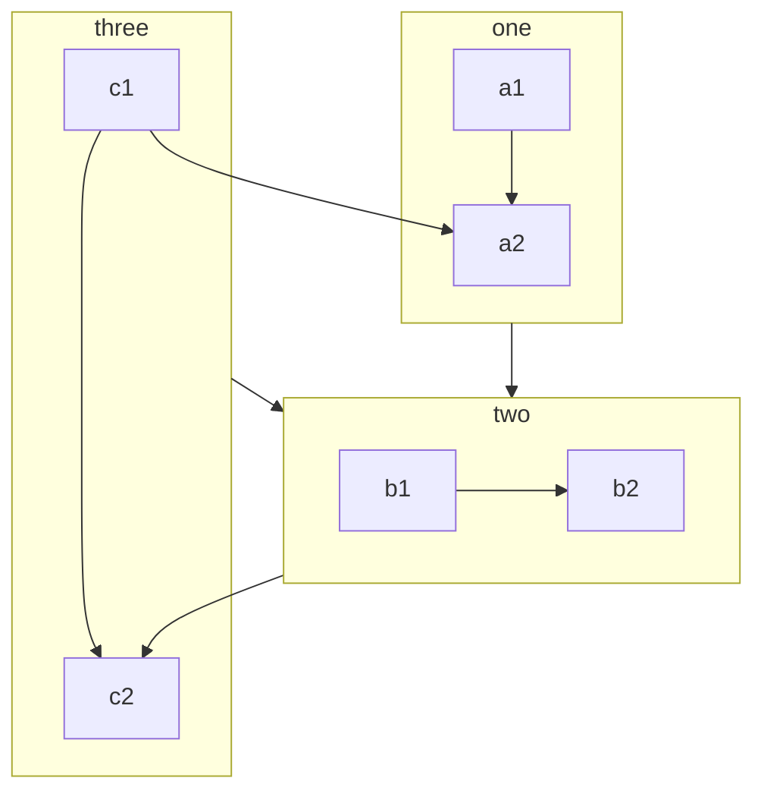

# Template - RepoAI (Repositório de Conhecimento em IA)

Esse repositório é um modelo (template) para a criação de repositórios do projeto RepoAI. 
Ao mesmo tempo, ele também é um repositório que ensina como participar do projeto e produzir outros repositórios :D

## Conteúdo
  - [Estilo Visual do Repositório](#estilo-visual-do-reposit%C3%B3rio)
  - [Repositório em Construção](#reposit%C3%B3rio-em-constru%C3%A7%C3%A3o)
  - [Pré-Requisitos e Instalações Necessárias](#se%C3%A7%C3%A3o-de-pr%C3%A9-requisitos-e-instala%C3%A7%C3%B5es-necess%C3%A1rias)
  - [Licença 📝](#licen%C3%A7a-)

## Estrutura do Repositório

Aqui você deve descrever brevemente a estrutura do repositório

```text
folder1/
└── folder2/
    ├── folder3/
    │   ├── file1
    │   └── file2
    └── folder4/
        ├── file3
        └── file4
```

## Estilo Visual do Repositório
Queremos que todos os repositórios publicados sigam o mesmo estilo visual, proporcionando assim uma experiência de sinergia aos visitantes. 
Para isso recomendamos os seguintes elementos visuais: 

- Adicione um banner temático no seu repositório. Use o formato de capa para redes sociais. Por exemplo, recomendamos utilizar os templates disponíveis no [Canva](https://www.canva.com/). Seja criativo!
- Utilize seções e subseções de acordo com esse template, respeitando o formato de fontes e tamanhos.
- Logo ao inicio desse arquivo, adicione índices dos conteúdos, e a estrutura de pastas do repositório.


## Repositório em Construção

Se você está desenvolvendo o repositório em grupos, ou mesmo está aberto a contribuições, você pode abrir uma lista simples de tarefas nas seções iniciais, para organizar as tarefas:

- [x] Tarefa 1
- [x] Tarefa 2
- [x] Tarefa 3
- [ ] Tarefa 4
- [ ] Tarefa 5

## Seção de Pré-Requisitos e Instalações Necessárias

Faça uma seção de pré-requisitos e instalações necessárias para a execução do tutorial apresentado junto ao repositório. Por exemplo:

### Pré-requisitos 💻 
Antes de começar, verifique se você atendeu aos seguintes requisitos:
- Você instalou a versão mais recente de `<linguagem / dependência / requeridos>`
- Você tem uma máquina `<Windows / Linux / Mac>`. Indique qual sistema operacional é compatível / não compatível.
- Você leu `<guia / link / documentação_relacionada_ao_projeto>`.

### Instalação 🚀 

Para instalar o <requisito>, siga estas etapas:

Linux e macOS:

```
<comando_de_instalação>
```

Windows:

```
<comando_de_instalação>
```

## Outras Seções 

### Seções Escondidas
Você pode fazer uso de seções escondidas, por exemplo, para exibir trechos de código básico que você acredita que nem todos os leitores terão a necessidade de ver. 
São elementos perfeitos para esse tipo de conteúdo, ou seja, que é opcional para leitores que já possuem algum background sobre o assunto do repositório. Exemplo:

<details>

<summary>Exemplo de Seção Escondida</summary>

### Ela pode conter títulos

Pode conter texto, imagens, blocos, código (essensialmente qualquer coisa)

```python
   print("Hello World").
```
</details>

### Alertas

Você pode usar alertas para enfatizar algum aspecto em seu tutorial: 

> [!NOTE]
> Instruções importantes que os usuários devem conhecer, mesmo ao ler rapidamente o conteúdo.

> [!TIP]
> Dicas úteis para fazer as coisas de forma melhor ou mais fácil.

> [!IMPORTANT]
> Informações essenciais que os usuários precisam saber para alcançar seu objetivo.

> [!WARNING]
> Informações urgentes que exigem a atenção imediata dos usuários para evitar problemas.

> [!CAUTION]
> Alertas sobre os riscos ou possíveis consequências negativas de certas ações.

### Diagramas
Você pode criar diagramas sem a necessidade de ferramentas externas, por exemplo:




## Contribuidores
 Você pode listar todos os contribuidores do seu projeto. Adicione a si mesmo. 

## Licença 📝
Ao final adicione uma breve descrição de que seu projeto está sobre a licença MIT + CC-BY, por exemplo:
Esse projeto está sob licença MIT + CC-BY. Veja o arquivo [LICENÇA](LICENSE) para mais detalhes.
