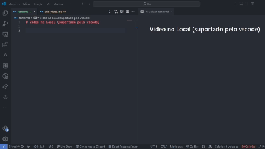

# Adicionando vídeos e GIF's
No GitHub apenas são permitidos incorporações de GIF's e imagens no markdown. Vídeos são dispiníveis apenas por links redirecionados para sites externos ou download de vídeos salvos no projeto.

## Adicionando GIF
Para adicionar um GIF, utilize a estrutura abaixo

```markdown

```


## Vídeo incorporado (vscode)
Para incorporar vídeos em plataformas que suportam vídeos incorporados(como o vscode), você pode utilizar a seguinte estrutura:
```html
<iframe width="560" height="315" src="https://www.youtube.com/embed/VIDEO_ID" frameborder="0" allow="accelerometer; autoplay; clipboard-write; encrypted-media; gyroscope; picture-in-picture" allowfullscreen></iframe>
```


Ou para inserir vídeo local, pode seguir essa estrutura:

```html
<video width="600" controls>
  <source src="video.mp4" type="video/mp4">
</video>
```


### Referencia por links
link para video local:
[Vídeo](video.mp4)
```markdown
[video-local](video.mp4)
```

### Vídeo online
Link para vídeo online:
[Youtube](https://www.youtube.com/watch?v=tO01J-M3g0U)
```markdown
[nome-youtube](https://www.youtube.com/video)
```
### Link Por imagem
[](https://www.youtube.com/watch?v=tO01J-M3g0U)
```markdown
[](https://www.youtube.com/video)
```